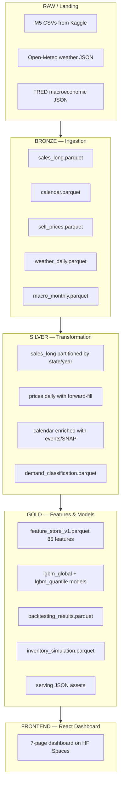

# AI Supply Chain Control Tower

End-to-end demand forecasting and inventory optimization platform built on real Walmart data.

[Live Demo](https://huggingface.co/spaces/hectorferrandizsanchis/ai-supply-chain-control-tower) | [Documentation](docs/)

---

## About this project

This is a portfolio project I built to demonstrate how data engineering, machine learning,
and operations research connect in a real business context. The platform predicts retail
demand at SKU-store level, quantifies forecast uncertainty using conformal prediction,
simulates inventory policies through Monte Carlo methods, and surfaces everything through
an interactive analytics dashboard.

Most forecasting projects I found online stop at training a model and plotting predictions.
I wanted to build the full stack: a proper data pipeline with schema validation and
lineage, demand classification before modeling, hierarchical reconciliation across 42,840
series, a simulation engine that converts forecasts into actionable inventory parameters,
and a deployed frontend that a non-technical user could actually navigate. The goal was to
understand what it takes to go from raw data to a decision that an operations manager
would trust.

This project was built with AI assistance (Claude and Cursor) under my design, supervision,
and quality control. Every architectural decision, every component boundary, and every
technical trade-off was my own. The AI was a tool for implementation speed, not a
replacement for understanding.

One important honesty note: the demand data is real (M5/Walmart open dataset). The
inventory layer — stock levels, purchase orders, lead times, stockout events, and supplier
parameters — is synthetic, generated by the simulation engine and explicitly labeled as
such throughout the codebase. This is documented in detail in
[docs/08_synthetic_data_disclaimer.md](docs/08_synthetic_data_disclaimer.md).

---

## What it does

```
M5 Walmart dataset (raw CSVs, 58.3M rows)
  -> Bronze layer: parquet ingestion, schema validation (Pandera)
  -> Silver layer: wide-to-long transform, price forward-fill, calendar enrichment
  -> Demand classification: ADI/CV2 matrix (smooth / erratic / intermittent / lumpy)
                            ABC/XYZ revenue and volatility segmentation
                            SCD Type 2 history in dim_product
  -> Feature store: 85 features across 8 families (lags, rolling stats, calendar,
                    price, intermittency, weather, macro, interactions)
                    Strict leakage controls: 6 rules enforced by test suite
  -> LightGBM global model: trained once across all 30,490 series
                             quantile outputs at p10/p50/p90
                             5-fold rolling-origin backtesting
  -> Conformal calibration: post-hoc split conformal for guaranteed coverage
  -> Hierarchical reconciliation: MinT-Shrink across 12 levels, 42,840 series
  -> Monte Carlo simulation: 1,000 paths x 90 days per series
                              safety stock, reorder points, EOQ, newsvendor
                              4 inventory policies compared
                              5 stress scenarios evaluated
  -> Export: serving JSON assets for the frontend
  -> Dashboard: 7-page React application deployed on Hugging Face Spaces
```

---

## Key numbers

| Metric | Value |
|--------|-------|
| Time series | 42,840 hierarchical (30,490 SKU-store level) |
| Observations | 58.3M (daily, January 2011 to June 2016) |
| Features | 85 across 8 families |
| Forecast MAE | 0.626 |
| WRMSSE | 0.551 |
| Coverage at 80% interval | 90.0% (conservative — intervals slightly wide) |
| Simulation fill rate | 89.7% |
| Test suite | 795 tests, 0 failures |
| Dashboard pages | 7 |

Pipeline metrics validated on a 500-series representative sample. Full-scale execution
across all 30,490 series requires more than 16 GB of RAM. The feature store build uses
chunked processing by store (10 stores, approximately 3,000 series each) to stay within
memory limits on consumer hardware.

---

## Architecture

Six layers from raw data to deployed dashboard:



**Raw/Bronze:** raw files land as-is; bronze writer validates schema with Pandera and
converts to columnar Parquet.

**Silver:** wide sales matrix (items as columns) melted to long format, prices
forward-filled from weekly to daily, calendar events and SNAP flags attached.
Demand classification runs here: each series gets ADI, CV2, demand_class, abc_class,
xyz_class.

**Gold/Features:** 85 features computed per series with strict leakage controls.
LightGBM trains on all series simultaneously (global model). Five rolling-origin
backtesting folds evaluate generalization. Conformal calibration adjusts prediction
intervals post-hoc. Hierarchical reconciliation ensures forecasts sum correctly across
the 12-level M5 hierarchy.

**Inventory:** Monte Carlo simulation runs 1,000 scenarios per series, deriving safety
stock, reorder points, and policy comparisons. All output is labeled SYNTHETIC.

**Frontend:** serving assets are static JSON files read by the React dashboard. No
backend required at runtime — the entire app deploys as a static site.

---

## Tech stack

**Data and ML:**
Python 3.11, Polars, LightGBM, statsforecast, hierarchicalforecast, Pandera, MLflow,
NumPy, scikit-learn, SHAP

**Frontend:**
React 18, TypeScript, Tailwind CSS, ECharts, Vite

**Infrastructure:**
GitHub Actions (CI/CD), Hugging Face Spaces (static deployment), dbt (SQL marts),
pytest (795 unit, integration, and E2E tests)

---

## Data sources

| Source | Type | Description |
|--------|------|-------------|
| M5 Forecasting (Kaggle) | Real | Walmart daily unit sales, 10 stores, 3,049 items, 2011-2016 |
| Open-Meteo archive API | Real | Historical weather (temperature, precipitation) for CA, TX, WI |
| FRED (St. Louis Fed) | Real | CPI, unemployment rate, consumer sentiment, WTI oil price |
| Inventory parameters | Synthetic | Stock levels, purchase orders, lead times, costs — simulation output |

---

## How to run

**Requirements:** Python 3.11+, Node.js 18+, Kaggle API credentials in `.env`

```bash
# Copy environment template and add your credentials
cp .env.example .env

# Install Python dependencies
make setup

# Run the full pipeline (steps 1-9: ingest through export)
python run_full_pipeline.py

# Or run steps individually
make ingest        # Download M5 + weather + macro data
make validate      # Run all data quality checks
make train_lgbm    # Train LightGBM global + quantile models
make evaluate      # Run 5-fold rolling-origin backtesting
make export_serving  # Generate JSON serving assets

# Start the dashboard locally
cd app
npm install
npm run dev

# Run the full test suite
pytest tests/ -v
```

The full pipeline takes approximately 20-40 minutes on a 16 GB machine.
Use `--sample 500` flag on `run_full_pipeline.py` for a fast 3-minute validation run.

---

## What is real vs synthetic

**Real data (from public sources):**
- All unit sales figures (M5/Walmart dataset, Kaggle)
- Product hierarchy: stores, departments, categories, item IDs
- Sell prices (weekly, forward-filled to daily)
- Calendar: dates, events, SNAP benefit days
- Weather: temperature and precipitation by state
- Macroeconomic indicators: CPI, unemployment, consumer sentiment

**Synthetic data (generated by this system):**
- Stock on hand and inventory trajectories
- Purchase orders: quantities, dates, lead times
- Stockout events: duration, estimated lost units and revenue
- Supplier parameters: lead time distributions, reliability scores
- Holding costs, ordering costs, service level targets

**Why synthetic inventory:** the M5 dataset only contains demand observations. There is
no public data on Walmart's actual stock levels, order history, or supplier contracts.
Simulating the operational layer on top of real demand is standard practice when building
a proof of concept for a supply chain system. The simulation uses realistic statistical
distributions and the outputs are clearly labeled as SYNTHETIC throughout the codebase,
dashboard, and documentation.

---

## Limitations

- Trained and validated on 2011-2016 data. Retail patterns have changed since then.
- No explicit promotion flags in M5. Promotions are approximated using price-drop proxies (>15% below rolling average), which introduces some noise.
- Inventory simulation uses synthetic parameters, not real Walmart operational data.
- Full pipeline execution requires more than 16 GB of RAM. The repository includes a 500-series sample mode for development.
- Batch planning system only — no real-time or streaming capability.
- Forecast intervals at the 80% level achieve 90% empirical coverage, meaning intervals are slightly conservative (wider than necessary).
- No explicit demand sensing from external signals like social media or search trends.

---

## Project structure

```
retail-demand-intelligence/
  src/
    ingest/          data ingestion (M5, weather, macro)
    transform/       silver pipeline (wide-to-long, price fill, calendar)
    classification/  demand classification (ADI/CV2, ABC/XYZ, SCD)
    features/        feature store (85 features, leakage guards)
    models/          LightGBM training, baselines, conformal calibration
    evaluation/      backtesting, metrics, SHAP
    inventory/       Monte Carlo simulation, policies, scenarios
    reconciliation/  hierarchical reconciliation (MinT-Shrink)
    monitoring/      drift detection, CUSUM, alert engine
    export/          serving JSON generator
  app/               React 18 dashboard (TypeScript + Tailwind + ECharts)
  tests/             795 tests (unit, integration, E2E)
  docs/              architecture, model cards, decision log, runbooks
  sql/               dbt staging and mart models
  contracts/         Pandera data contracts (YAML)
  configs/           pipeline configuration
  .github/workflows/ CI (lint + test + frontend build) + HF Space deploy
```

---

## Built by

Hector Ferrandiz Sanchis
18 years old, Valencia, Spain

Portfolio project built with AI assistance (Claude, Cursor) under my design,
supervision, and quality control.

[GitHub](https://github.com/farrandizhector-dev/retail-demand-intelligence) | [Live Demo](https://huggingface.co/spaces/hectorferrandizsanchis/ai-supply-chain-control-tower)

---

## License

MIT
