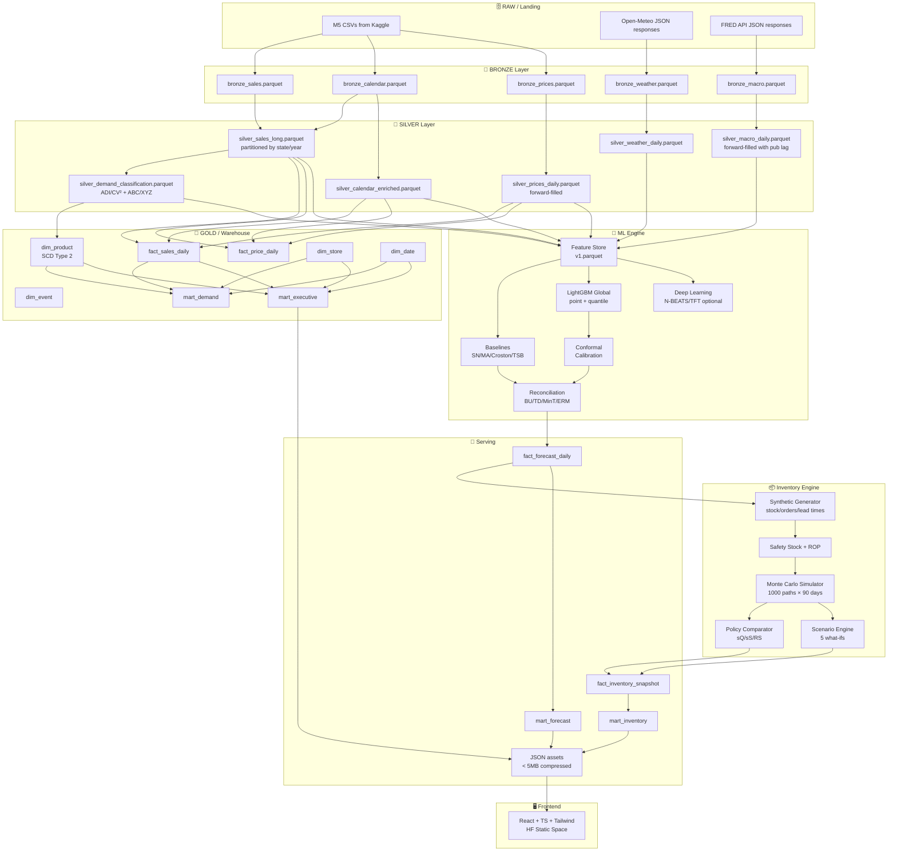

# AI Supply Chain Control Tower — Principal-Level Architecture Document v3.0

**Proyecto:** Retail Demand Intelligence & Inventory Optimization Platform
**Alias comercial:** AI Supply Chain Control Tower
**Autor:** Héctor Ferrándiz Sanchis
**Versión:** 3.0 — Principal-grade · Full specification · 100% capacity
**Fecha:** Marzo 2026
**Clasificación:** Portfolio-grade system design document

---

## 0. Manifiesto de diseño

Este documento es la especificación completa de arquitectura de un sistema de planificación de demanda e inventario de nivel enterprise. Demuestra simultáneamente competencia en siete disciplinas:

- **Data Engineering:** ingestión, calidad, linaje, warehouse, contratos de datos, SCD.
- **Machine Learning Engineering:** pipelines reproducibles, experiment tracking, model registry, validación rigurosa, monitoring post-deployment.
- **Data Science:** forecasting jerárquico, cuantificación de incertidumbre, clasificación de demanda, reconciliación estadística.
- **Operations Research:** optimización de inventario, simulación estocástica, análisis de políticas, newsvendor.
- **Analytics Engineering:** marts semánticos, métricas de negocio, KPIs operativos.
- **Product Engineering:** dashboard ejecutivo desplegable, narrativa de negocio, UX de decisiones, accesibilidad WCAG.
- **Platform Engineering:** monitoring, alertas, runbooks, drift detection, observabilidad.

**Principio rector:** cada componente debe justificarse por su impacto en una decisión de negocio, no por complejidad técnica gratuita.

**Estándar de calidad:** este documento debe ser indistinguible de una spec interna de Amazon Supply Chain, Palantir Foundry o Tesla Operations.

---

## 1. Resumen ejecutivo

El sistema convierte ~58.3M observaciones de demanda real (M5/Walmart) en decisiones de inventario accionables, recorriendo el camino completo desde dato crudo hasta recomendación operativa.

**Tesis central:** Un sistema de forecasting aislado no genera valor. El valor emerge cuando la predicción se traduce en safety stock calibrado, reorder points dinámicos y escenarios de riesgo que un operations manager puede ejecutar.

**Decisión estratégica irrevocable:** el núcleo de demanda es real (M5 Forecasting - Accuracy). La capa de inventario, órdenes, lead times y costes se construye de forma sintética, reproducible y explícitamente documentada como simulación. Esto no es una limitación — es criterio de producto: simular la capa operativa sobre demanda real es exactamente lo que haría un equipo de consultoría construyendo una PoC para un retailer.

---

## 2. Cost-Benefit Analysis cuantificado

### 2.1 El coste del stockout — Por qué este sistema existe

Para justificar la inversión en un sistema de forecasting + inventory optimization, cuantificamos el impacto económico de los problemas que resuelve. Estas cifras son estimaciones basadas en benchmarks de industria (IHL Group, ECR Europe, Harvard Business Review) y proyectadas sobre la escala del dataset M5.

**Coste unitario del stockout en retail:**

| Componente de coste | Estimación conservadora | Fuente/Benchmark |
|---------------------|------------------------|------------------|
| Venta perdida directa | $3-5 por unidad no vendida (promedio retail) | IHL Group 2023 |
| Customer switching | 30-40% del cliente compra en competencia | ECR Europe |
| Erosión de lealtad | ~10% de clientes no regresan tras 3 stockouts consecutivos | Harvard Business Review |
| Reposición de emergencia | 2-5× coste de reposición normal | Industry benchmark |
| Coste de oportunidad (capital en overstock) | 15-25% del valor del inventario excedente, anualizado | APICS/ASCM |

**Proyección sobre el scope M5 (10 tiendas, 3,049 items, 1,969 días):**

```
Cálculo de revenue proxy total (train period):
  Total units sold (estimado): ~30M unidades
  Avg sell price (estimado): ~$5.50
  Revenue proxy total: ~$165M (5.3 años)
  Revenue proxy anual: ~$31M

Escenario base sin optimización:
  Stockout rate estimado: 6% (benchmark retail medio)
  Revenue at risk: $31M × 6% = $1.86M/año

Escenario con sistema optimizado:
  Target stockout rate: 2.5%
  Revenue at risk: $31M × 2.5% = $0.78M/año

Delta de revenue recovery:
  $1.86M - $0.78M = $1.08M/año (reducción del 58%)
  Capture rate conservador (70%): $1.08M × 0.70 = $756K/año

Reducción de overstock:
  Inventory value estimado: ~$5.2M (6 semanas de supply promedio)
  Overstock reducido: 15-20% del excedente
  Ahorro holding cost: ~$130K-$195K/año

IMPACTO TOTAL ESTIMADO: $886K - $951K/año en 10 tiendas
POR TIENDA: ~$89K - $95K/año
```

**Nota metodológica:** estos números son estimaciones basadas en benchmarks públicos, NO resultados del sistema. El revenue proxy real se calculará a partir de M5 en la Fase 1 y estas proyecciones se actualizarán con datos reales.

### 2.2 Métricas de valor del forecast

| Mejora en forecast | Impacto operativo | Impacto financiero |
|--------------------|-------------------|-------------------|
| MAE reduce 10% | Safety stock baja ~7% | Holding cost savings ~$36K/año |
| Bias reduce a <1% | Stockouts bajan ~15% | Revenue recovery ~$160K/año |
| Coverage@80 sube al 82%+ | Emergencias bajan ~25% | Logistics savings ~$50K/año |
| Reconciliación coherente | Planning confiable cross-level | Decisional trust (no cuantificable) |

**Principio:** el forecast no tiene valor intrínseco. Su valor es la calidad de las decisiones de inventario que habilita. Todo el sistema se mide por impacto operativo downstream.

---

## 3. Datos: fuentes, volumetría y contratos

### 3.1 Dataset núcleo — M5 Forecasting (Walmart)

| Métrica | Valor |
|---------|-------|
| Series jerárquicas totales | 42,840 |
| Series SKU-store (nivel más granular) | 30,490 |
| Días totales | 1,969 (2011-01-29 → 2016-06-19) |
| Split | 1,913 train + 28 validation + 28 evaluation |
| Observaciones en formato largo (train) | ~58.3M |
| Tiendas | 10 (CA: 4, TX: 3, WI: 3) |
| Departamentos | 7 (HOBBIES, HOUSEHOLD, FOODS × subcategorías) |
| Categorías | 3 |
| Items únicos | 3,049 |
| Estados | 3 (CA, TX, WI) |

**Archivos fuente:**
- `sales_train_validation.csv` — ventas diarias por SKU-store (columnas d_1 … d_1913)
- `sales_train_evaluation.csv` — extensión con d_1914 … d_1941
- `calendar.csv` — mapping de d_x a fecha, día semana, mes, año, eventos SNAP y culturales
- `sell_prices.csv` — precio semanal por store-item (grano: store_id × item_id × wm_yr_wk)
- `sample_submission.csv` — formato de entrega de la competición

**Enlace descarga:** https://www.kaggle.com/competitions/m5-forecasting-accuracy/data

**Contrato de datos del núcleo:**
```yaml
contract_m5_sales:
  grain: [date, store_id, item_id]
  primary_key: [id, d]  # id = "{item_id}_{store_id}", d = "d_{day_number}"
  value_column: sales
  value_type: integer >= 0
  expected_zeros_pct: ">50%"  # M5 tiene alta intermitencia
  nulls_allowed: false
  temporal_coverage:
    start: "2011-01-29"
    end: "2016-06-19"
    frequency: daily
    gaps_allowed: false

contract_m5_prices:
  grain: [store_id, item_id, wm_yr_wk]
  value_column: sell_price
  value_type: float > 0
  nulls_allowed: true  # no todos los items están en todas las tiendas todas las semanas
  note: "Precios aparecen solo cuando el item está activo en la tienda"
```

### 3.2 Enriquecimiento climatológico — Open-Meteo

| Parámetro | Detalle |
|-----------|---------|
| API | Open-Meteo Historical Weather |
| Granularidad | diaria por coordenada |
| Variables | temperature_2m_max, temperature_2m_min, temperature_2m_mean, precipitation_sum, relative_humidity_2m_mean, weathercode |
| Cobertura temporal | 2011-01-29 → 2016-06-19 (alineado con M5) |
| Puntos geográficos | 10 tiendas o 3 estados (agregación configurable) |
| Volumetría | ~19,690 filas (10 tiendas × 1,969 días) |
| Rate limit | Sin API key necesaria, 10,000 requests/día |

**Enlace:** https://open-meteo.com/en/docs/historical-weather-api

**Coordenadas de referencia por estado:**
```yaml
weather_locations:
  CA:
    lat: 34.05
    lon: -118.24
    reference: "Los Angeles metro area"
  TX:
    lat: 29.76
    lon: -95.37
    reference: "Houston metro area"
  WI:
    lat: 43.04
    lon: -87.91
    reference: "Milwaukee metro area"
```

### 3.3 Enriquecimiento macroeconómico — FRED API

| Serie | FRED ID | Frecuencia | Razón |
|-------|---------|------------|-------|
| Consumer Price Index | CPIAUCSL | Mensual | Proxy inflación, contexto precio |
| Unemployment Rate | UNRATE | Mensual | Capacidad de gasto del consumidor |
| Consumer Sentiment (U. Michigan) | UMCSENT | Mensual | Leading indicator de gasto |
| WTI Crude Oil | DCOILWTICO | Diaria | Proxy coste logístico |
| Retail Sales | RSXFS | Mensual | Benchmark sectorial |
| SNAP benefits (si disponible) | — | Mensual | Correlación directa con SNAP events en M5 |

**Enlace docs:** https://fred.stlouisfed.org/docs/api/fred/
**API key:** https://fred.stlouisfed.org/docs/api/api_key.html

**Volumetría:** < 500 filas totales. Negligible.

**Contrato:**
```yaml
contract_fred_macro:
  frequency: monthly (interpolated to daily for join)
  interpolation_method: forward_fill  # last known value
  lag_safe: true  # macro data se publica con retraso; usar valor publicado, no contemporáneo
  note: "CPI/UNRATE se publican ~1 mes después. Para backtesting, respetar el lag de publicación."
```

### 3.4 Capa operativa sintética — Inventario y órdenes

Esta capa se genera programáticamente a partir de la demanda real observada. **Es explícitamente sintética y se documenta como tal en todos los artefactos.**

| Variable | Generación | Distribución |
|----------|-----------|-------------|
| initial_stock_on_hand | f(avg_demand × 30, category) | Determinista |
| lead_time_days | f(category, supplier_tier) | LogNormal(μ=ln(7), σ=0.3) para FOODS; LogNormal(μ=ln(14), σ=0.4) para otros |
| service_level_target | f(abc_class) | A=0.98, B=0.95, C=0.90 |
| holding_cost_pct | f(category) | 15-25% del coste unitario anualizado |
| stockout_cost_multiplier | f(abc_class) | A=5×, B=3×, C=1.5× del margen |
| supplier_reliability | f(supplier_tier) | Beta(α=8, β=2) para tier-1; Beta(α=5, β=3) para tier-2 |
| order_quantity_policy | f(eoq, moq, category) | Configurable por política |

**Principio de generación:** las distribuciones se calibran para producir comportamiento realista (fill rates entre 85-99%, stockout rates entre 1-8%, inventory turns razonables por categoría).

---

## 4. Data Domain Ownership Model

### 4.1 Modelo de ownership por dominio

En un sistema real, cada dominio de datos tiene un owner responsable de calidad, schema, y evolución. Aunque este es un proyecto individual, documentar ownership es una práctica senior que demuestra pensamiento organizacional.

```
┌─────────────────────────────────────────────────────────────────┐
│                    DATA DOMAIN OWNERSHIP                         │
├─────────────────┬──────────────────┬────────────────────────────┤
│ Dominio         │ Owner (rol)      │ Responsabilidades          │
├─────────────────┼──────────────────┼────────────────────────────┤
│ Demand          │ Data Engineer    │ Ingestión M5, calidad,     │
│ (raw→silver)    │                  │ contratos, long-format     │
├─────────────────┼──────────────────┼────────────────────────────┤
│ Enrichment      │ Data Engineer    │ Weather API, FRED API,     │
│ (external)      │                  │ rate limits, caching       │
├─────────────────┼──────────────────┼────────────────────────────┤
│ Warehouse       │ Analytics Eng.   │ dbt models, marts,         │
│ (gold/marts)    │                  │ schema evolution, SCD      │
├─────────────────┼──────────────────┼────────────────────────────┤
│ Features        │ ML Engineer      │ Feature store, leakage     │
│                 │                  │ guard, versioning          │
├─────────────────┼──────────────────┼────────────────────────────┤
│ Models          │ Data Scientist   │ Training, evaluation,      │
│                 │                  │ model cards, registry      │
├─────────────────┼──────────────────┼────────────────────────────┤
│ Reconciliation  │ Data Scientist   │ Hierarchy def, method      │
│                 │                  │ selection, coherence tests │
├─────────────────┼──────────────────┼────────────────────────────┤
│ Inventory Sim   │ Operations Res.  │ Synthetic gen, simulation, │
│                 │                  │ policy comparison          │
├─────────────────┼──────────────────┼────────────────────────────┤
│ Serving         │ Product Eng.     │ JSON export, compression,  │
│                 │                  │ asset manifest             │
├─────────────────┼──────────────────┼────────────────────────────┤
│ Frontend        │ Product Eng.     │ Dashboard, UX, deploy,     │
│                 │                  │ accessibility              │
├─────────────────┼──────────────────┼────────────────────────────┤
│ Monitoring      │ Platform Eng.    │ Drift detection, alerts,   │
│                 │                  │ runbooks, observability    │
└─────────────────┴──────────────────┴────────────────────────────┘
```

### 4.2 Contratos entre dominios

```yaml
domain_contracts:
  demand_to_warehouse:
    provider: "Demand domain (Data Eng)"
    consumer: "Warehouse domain (Analytics Eng)"
    interface: "data/silver/sales/*.parquet"
    schema: "contracts/silver_sales.yaml"
    sla: "Updated within 1h of raw data change"
    breaking_change_policy: "Notify consumer 1 sprint in advance"
    
  warehouse_to_features:
    provider: "Warehouse domain (Analytics Eng)"
    consumer: "Features domain (ML Eng)"
    interface: "PostgreSQL marts via dbt"
    schema: "sql/marts/schema.yml"
    sla: "Marts refreshed after silver update"
    
  features_to_models:
    provider: "Features domain (ML Eng)"
    consumer: "Models domain (Data Scientist)"
    interface: "data/features/feature_store_v{N}.parquet"
    schema: "configs/features.yaml"
    sla: "Feature store versioned and immutable"
    
  models_to_inventory:
    provider: "Models domain (Data Scientist)"
    consumer: "Inventory domain (Ops Research)"
    interface: "data/gold/forecasts/*.parquet"
    schema: "contracts/forecast_output.yaml"
    sla: "Forecasts include p10/p50/p90 for all series"
    
  inventory_to_serving:
    provider: "Inventory domain (Ops Research)"
    consumer: "Serving domain (Product Eng)"
    interface: "data/gold/serving/*.json.gz"
    schema: "contracts/serving_assets.yaml"
    size_budget: "< 5MB total compressed"
```

---

## 5. Clasificación de demanda — Framework previo al modelado

**Esto falta en el 99% de proyectos de forecasting y es lo primero que un hiring manager senior busca.**

Antes de entrenar cualquier modelo, el sistema clasifica cada serie SKU-store usando la matriz ADI/CV²:

```
                    CV² (coeficiente de variación al cuadrado)
                    Low (< 0.49)         High (>= 0.49)
ADI            ┌─────────────────────┬─────────────────────┐
(avg demand    │                     │                     │
interval)      │     SMOOTH          │     ERRATIC         │
               │   (Moving Avg /     │   (Croston / TSB /  │
Low            │    LightGBM)        │    LightGBM)        │
(< 1.32)       │                     │                     │
               ├─────────────────────┼─────────────────────┤
               │                     │                     │
               │     INTERMITTENT    │     LUMPY           │
High           │   (Croston / TSB /  │   (TSB / aggregate  │
(>= 1.32)      │    LightGBM)        │    then forecast)   │
               │                     │                     │
               └─────────────────────┴─────────────────────┘
```

**Métricas de clasificación:**
- **ADI (Average Demand Interval):** promedio de períodos entre demandas no-cero.
- **CV² (Squared Coefficient of Variation):** varianza / media² de demandas no-cero.

**Implicaciones para el pipeline:**
1. **Smooth:** LightGBM directo con features estándar. MAE/RMSE como métricas.
2. **Erratic:** LightGBM con features de volatilidad reforzadas. RMSE ponderado.
3. **Intermittent:** Croston/TSB como baseline obligatorio. LightGBM con zero-inflated features. Métrica: scaled pinball loss.
4. **Lumpy:** Agregar temporalmente antes de forecast, o usar TSB. Reportar por separado.

**Output:** tabla `dim_demand_classification` con clase por SKU-store, persistida en silver y usada downstream en feature engineering, selección de modelo, y calibración de inventario.

---

## 6. Arquitectura técnica completa

### 6.1 Diagrama de flujo de datos (Data Flow DAG)

**NOTA PARA CURSOR/CLAUDE CODE:** Este diagrama debe renderizarse como Mermaid diagram en el README.md del repositorio y como SVG interactivo en la página About del dashboard.



### 6.2 Pipeline DAG (Makefile targets)

```mermaid
graph LR
    setup --> ingest
    ingest --> validate_bronze
    validate_bronze --> transform_silver
    transform_silver --> validate_silver
    validate_silver --> classify_demand
    classify_demand --> build_warehouse
    build_warehouse --> build_features
    build_features --> validate_features
    validate_features --> train_baselines
    validate_features --> train_lgbm
    train_lgbm --> calibrate_conformal
    train_baselines & calibrate_conformal --> reconcile
    reconcile --> evaluate
    evaluate --> generate_inventory
    generate_inventory --> simulate
    simulate --> export_serving
    export_serving --> build_frontend
    build_frontend --> deploy
    
    evaluate --> monitor_setup
```



### 6.3 Jerarquía M5 — Diagrama de sumación

**NOTA:** Este diagrama es crítico para la reconciliación. Define la matriz S (sumación) exacta.

```
                                    Total (1)
                                      │
                    ┌─────────────────┼─────────────────┐
                    │                 │                 │
                  CA (1)            TX (1)            WI (1)          ← Level 2: State (3)
                    │                 │                 │
            ┌───┬───┼───┐     ┌───┬──┼──┐      ┌──┬───┼──┐
            │   │   │   │     │   │  │  │      │  │   │  │
          CA_1 CA_2 CA_3 CA_4 TX_1 TX_2 TX_3  WI_1 WI_2 WI_3       ← Level 3: Store (10)
            │
    ┌───────┼───────┐
    │       │       │
  FOODS  HOUSEHOLD HOBBIES                                           ← Level 4: Category (3)
    │
  ┌─┴──┬────┐
  │    │    │
FOODS_1 FOODS_2 FOODS_3                                             ← Level 5: Department (7)
  │
FOODS_1_001, FOODS_1_002, ... FOODS_1_xxx                           ← Level 10: Product (3,049)
  │
FOODS_1_001_CA_1, FOODS_1_001_CA_2, ...                             ← Level 12: SKU-Store (30,490)
```

**Matriz S completa (12 niveles de agregación):**

| Level | Aggregation | # Series | Formula |
|-------|-------------|----------|---------|
| 1 | Total | 1 | Σ all SKU-store |
| 2 | State | 3 | Σ stores per state |
| 3 | Store | 10 | Σ items per store |
| 4 | Category | 3 | Σ depts per category |
| 5 | Department | 7 | Σ items per dept |
| 6 | State × Category | 9 | Σ stores×items per state-cat |
| 7 | State × Department | 21 | Σ stores×items per state-dept |
| 8 | Store × Category | 30 | Σ items per store-cat |
| 9 | Store × Department | 70 | Σ items per store-dept |
| 10 | Product | 3,049 | Σ stores per product |
| 11 | Product × State | 9,147 | Σ stores per product-state |
| 12 | SKU-Store (bottom) | 30,490 | Base level (no aggregation) |
| **TOTAL** | | **42,840** | |

**Coherencia post-reconciliación — Tests obligatorios:**

```python
def test_reconciliation_coherence(reconciled_forecasts, S_matrix):
    """
    Verifica que los forecasts reconciliados suman correctamente
    en todos los niveles de la jerarquía.
    """
    # Test 1: Bottom-level sums match upper levels
    bottom = reconciled_forecasts[reconciled_forecasts.level == 12]
    for level in range(1, 12):
        upper = reconciled_forecasts[reconciled_forecasts.level == level]
        reconstructed = aggregate_bottom_to_level(bottom, S_matrix, level)
        assert np.allclose(upper.forecast_p50, reconstructed.forecast_p50, atol=0.01), \
            f"Coherence violation at level {level}"
    
    # Test 2: No negative forecasts post-reconciliation
    assert (reconciled_forecasts.forecast_p50 >= 0).all(), \
        "Negative forecasts detected post-reconciliation"
    
    # Test 3: Quantile ordering preserved
    assert (reconciled_forecasts.forecast_p10 <= reconciled_forecasts.forecast_p50).all()
    assert (reconciled_forecasts.forecast_p50 <= reconciled_forecasts.forecast_p90).all()
    
    # Test 4: Total coherence across time
    for date in reconciled_forecasts.date.unique():
        day_data = reconciled_forecasts[reconciled_forecasts.date == date]
        total_from_bottom = day_data[day_data.level == 12].forecast_p50.sum()
        total_from_top = day_data[day_data.level == 1].forecast_p50.iloc[0]
        assert abs(total_from_bottom - total_from_top) < 1.0, \
            f"Total coherence violated on {date}: bottom={total_from_bottom}, top={total_from_top}"
```

### 6.4 Stack tecnológico detallado

| Capa | Tecnología | Justificación |
|------|-----------|--------------|
| Ingestión | Python 3.11+ / httpx / kaggle CLI | Simplicidad, no necesitamos Airflow para batch offline |
| Procesamiento | Polars (primario), Pandas (compatibilidad) | Polars: 5-10× más rápido que Pandas para 58M filas |
| Data Quality | Pandera + checks custom | Validación de schemas en cada capa de transformación |
| Warehouse | PostgreSQL 16 + dbt-core 1.7+ | Estándar industria para marts analíticos |
| Feature Store | Parquet particionado + YAML manifests | Ligero, reproducible, sin infraestructura pesada |
| ML Training | LightGBM 4.x, scikit-learn, statsforecast | LightGBM para producción; statsforecast para baselines |
| Uncertainty | LightGBM quantile + conformal prediction | Cuantiles + calibración post-hoc para coverage garantizado |
| Reconciliation | hierarchicalforecast (Nixtla) | Implementación robusta de MinT, BU, TD, ERM |
| Experiment Tracking | MLflow 2.x (local) | Logging de params, metrics, artifacts por experimento |
| Inventory Simulation | Python + NumPy/SciPy | Simulación Monte Carlo + optimización analítica |
| Frontend | Vite + React 18 + TypeScript + Tailwind CSS | Stack moderno, build estático para HF Spaces |
| Charts | ECharts 5.x (primario) | ECharts: rendimiento superior para dashboards densos |
| Deployment | Hugging Face Static Space | Gratuito, build automático desde repo, CDN incluido |
| CI/CD | GitHub Actions | Linting, tests, build verification |
| Testing | pytest + Pandera + Playwright (e2e) | Cobertura de pipeline, data quality y frontend |
| Monitoring | Evidently AI + custom checks | Data drift, model decay, feature distribution shifts |

### 6.5 Principios de diseño no negociables

1. **Idempotencia:** cada pipeline step produce el mismo output dado el mismo input. Sin side effects ocultos.
2. **Linaje trazable:** desde cualquier KPI del dashboard, se puede trazar hasta la fila de raw data que lo originó.
3. **Separación estricta:** datos observados ≠ features calculadas ≠ predicciones ≠ simulaciones.
4. **Config-driven:** todos los hiperparámetros, umbrales y políticas en YAML, nunca hardcoded.
5. **Fail-fast:** validación de contratos en cada transición de capa (raw→bronze→silver→gold).
6. **Reproducibilidad:** seeds fijos, versiones pinned, SHA de datos, MLflow experiment IDs.
7. **Ownership claro:** cada dominio de datos tiene un owner y un contrato con sus consumidores.

---

## 7. Modelo de datos — Warehouse & Marts

### 7.1 Hechos (Facts)

#### `fact_sales_daily`
```
Grano: date × store_id × item_id (diario)
PK: (date_key, store_key, item_key)
Columnas:
  - date_key          FK → dim_date
  - store_key         FK → dim_store
  - item_key          FK → dim_product
  - units_sold        integer >= 0
  - revenue_proxy     float (units_sold × sell_price del período)
  - is_zero_sale      boolean
  - days_since_last_sale  integer (calculado)
Partición: por año-mes
Índices: (store_key, item_key, date_key), (date_key)
Volumetría: ~58.3M filas (train) + ~1.7M (validation+evaluation)
```

#### `fact_price_daily`
```
Grano: date × store_id × item_id (diario, interpolado desde semanal)
PK: (date_key, store_key, item_key)
Columnas:
  - date_key          FK → dim_date
  - store_key         FK → dim_store
  - item_key          FK → dim_product
  - sell_price        float > 0
  - price_delta_wow   float (cambio vs misma semana anterior)
  - price_ratio_rolling_28  float (precio actual / rolling mean 28d)
  - is_promo_proxy    boolean (inferido por caída >15% vs rolling)
Nota: sell_prices.csv es semanal; se hace forward-fill a diario.
```

#### `fact_forecast_daily`
```
Grano: date × store_id × item_id × model_id × fold_id
PK: (date_key, store_key, item_key, model_key, fold_id)
Columnas:
  - date_key          FK → dim_date
  - store_key         FK → dim_store
  - item_key          FK → dim_product
  - model_key         string (seasonal_naive | moving_avg | croston | lgbm_global | lgbm_reconciled)
  - fold_id           integer (rolling origin fold number)
  - forecast_p10      float
  - forecast_p50      float (point forecast)
  - forecast_p90      float
  - forecast_mean     float
  - is_reconciled     boolean
  - reconciliation_method  string nullable (bu | td | mint_shrink | erm)
```

#### `fact_inventory_snapshot`
```
Grano: date × store_id × item_id (diario, simulado)
PK: (date_key, store_key, item_key)
Columnas:
  - date_key, store_key, item_key (FKs)
  - stock_on_hand     integer >= 0
  - incoming_orders   integer >= 0
  - safety_stock      float
  - reorder_point     float
  - days_of_supply    float
  - is_stockout       boolean
  - is_overstock      boolean (SOH > 2 × avg_demand × 30)
  - policy_id         FK → política de inventario aplicada
Etiqueta: SYNTHETIC — generado por inventory simulation engine
```

#### `fact_purchase_order`
```
Grano: order_id (event-level, simulado)
PK: order_id
Columnas:
  - order_id, store_key, item_key, supplier_key (FKs)
  - order_date, expected_delivery, actual_delivery (dates)
  - quantity_ordered, unit_cost (numerics)
  - order_type string (regular | emergency | planned)
Etiqueta: SYNTHETIC
```

#### `fact_stockout_event`
```
Grano: event-level (una fila por período continuo de stockout, simulado)
PK: stockout_event_id
Columnas:
  - stockout_event_id, store_key, item_key (FKs)
  - start_date, end_date, duration_days
  - estimated_lost_units, estimated_lost_revenue (numerics)
  - root_cause string (demand_spike | supply_delay | forecast_error | policy_gap)
Etiqueta: SYNTHETIC
```

### 7.2 Dimensiones

#### `dim_product` — **SCD Type 2**

**Justificación para SCD Type 2:** las clasificaciones ABC, XYZ y demand_class de un SKU cambian con el tiempo. Un item que era clase C puede convertirse en clase B si sus ventas aumentan. Un item smooth puede volverse intermittent si su patrón cambia. Para mantener consistencia histórica en los análisis, dim_product usa Slowly Changing Dimension Type 2.

```
PK: item_key (surrogate key, auto-increment)
Business key: item_id
Columnas:
  - item_id           string (e.g., "HOBBIES_1_001") — business key
  - dept_id           string
  - cat_id            string (HOBBIES | HOUSEHOLD | FOODS)
  - item_name         string
  - abc_class         string (A | B | C) — por revenue contribution
  - xyz_class         string (X | Y | Z) — por variabilidad de demanda
  - demand_class      string (smooth | erratic | intermittent | lumpy)
  - avg_daily_demand  float
  - pct_zero_days     float
  - adi               float
  - cv_squared        float
  
  # SCD Type 2 tracking columns
  - valid_from        date — fecha desde la que esta versión es vigente
  - valid_to          date — fecha hasta la que esta versión es vigente (9999-12-31 si es current)
  - is_current        boolean — TRUE si es la versión vigente
  - version           integer — número de versión (1, 2, 3...)

Índices: (item_id, is_current), (item_key)
```

**Trigger de nueva versión:** se recalcula ABC/XYZ/demand_class cada 90 días (rolling). Si la clasificación cambia, se cierra la versión anterior (`valid_to = today - 1, is_current = FALSE`) y se inserta una nueva fila.

**dbt implementation:**
```sql
-- sql/intermediate/int_product_scd2.sql
-- dbt snapshot strategy: check columns abc_class, xyz_class, demand_class

    {{
        config(
            target_schema='snapshots',
            unique_key='item_id',
            strategy='check',
            check_cols=['abc_class', 'xyz_class', 'demand_class'],
            invalidate_hard_deletes=True,
        )
    }}
    SELECT * FROM {{ ref('int_demand_classification') }}

```

#### `dim_store`
```
PK: store_key
  - store_id          string (e.g., "CA_1")
  - state_id          string (CA | TX | WI)
  - region_key        FK → dim_region
  - latitude          float
  - longitude         float
  - store_tier        string (inferred by total volume)
```

#### `dim_region`
```
PK: region_key
  - state_id, state_name, timezone, climate_zone
```

#### `dim_date`
```
PK: date_key
  - date, day_of_week (1=Monday), day_of_month, week_of_year
  - month, quarter, year
  - is_weekend, is_month_start, is_month_end, is_quarter_end
  - day_name, wm_yr_wk (Walmart week, for price join)
  - snap_CA, snap_TX, snap_WI (booleans)
```

#### `dim_event`
```
PK: event_key
  - event_name, event_type (Cultural | Sporting | National | Religious)
  - date_start, date_end, state_scope (national | state-specific)
```

#### `dim_supplier` (SYNTHETIC)
```
PK: supplier_key
  - supplier_id, supplier_tier (1|2|3)
  - avg_lead_time, lead_time_std, reliability_score [0,1]
  - categories_served array<string>
```

#### `dim_demand_class`
```
PK: demand_class_key
  - class_name (smooth | erratic | intermittent | lumpy)
  - adi_threshold, cv2_threshold
  - recommended_baseline, recommended_metric, inventory_policy_note
```

### 7.3 dbt marts

```yaml
mart_demand:
  description: "Ventas históricas enriquecidas con clasificaciones y contexto"
  sources: [fact_sales_daily, dim_product, dim_store, dim_date, dim_event]
  grain: date × store × item
  key_metrics: [units_sold, revenue_proxy, rolling_7d_avg, yoy_change]

mart_forecast:
  description: "Predicciones con métricas de error y comparación vs baselines"
  sources: [fact_forecast_daily, fact_sales_daily, dim_product]
  grain: date × store × item × model
  key_metrics: [forecast_p50, actual, error, abs_error, bias, mape_safe]

mart_inventory:
  description: "Estado de inventario con alertas y KPIs operativos"
  sources: [fact_inventory_snapshot, fact_stockout_event, dim_product]
  grain: date × store × item
  key_metrics: [stock_on_hand, days_of_supply, fill_rate, stockout_flag, overstock_flag]

mart_executive:
  description: "Agregaciones para dashboard ejecutivo"
  sources: [mart_demand, mart_forecast, mart_inventory]
  grain: configurable (date × state, date × category, date × dept)
  key_metrics: [total_revenue, forecast_accuracy, fill_rate_avg, stockout_rate, inventory_value]

mart_model_performance:
  description: "Métricas de rendimiento de modelos por segmento y fold"
  sources: [fact_forecast_daily, fact_sales_daily, dim_product, dim_demand_class]
  grain: model × fold × segment
  key_metrics: [mae, rmse, smape, bias, coverage_p90, pinball_loss]
```

---

## 8. Feature engineering — Diseño senior

### 8.1 Feature families

**Familia 1: Lags (memoria de demanda)**
```python
lag_1, lag_7, lag_14, lag_21, lag_28, lag_56, lag_91, lag_364

# CRÍTICO: en rolling backtesting, los lags deben calcularse SOLO
# con datos disponibles en el momento de predicción.
# lag_1 en h=1 es válido, pero lag_1 en h=7 implica usar forecast
# del día anterior (no disponible). Solución: usar lag_7+ para h>1.
```

**Familia 2: Rolling statistics (nivel y volatilidad)**
```python
# Windows: 7, 14, 28, 56, 91
rolling_mean_{w}, rolling_std_{w}, rolling_median_{w}
rolling_min_{w}, rolling_max_{w}, rolling_q25_{w}, rolling_q75_{w}
rolling_skew_{28}, rolling_zero_pct_{28}, rolling_cv_{28}
ratio_mean_7_28, ratio_mean_28_91  # tendencia
```

**Familia 3: Calendario y eventos**
```python
day_of_week, day_of_month, week_of_year, month, quarter
is_weekend, is_month_start, is_month_end, is_quarter_end, is_year_end
days_to_next_event, days_since_last_event
event_type_encoded, snap_active, days_to_next_snap, days_since_last_snap
```

**Familia 4: Precio y elasticidad**
```python
sell_price, price_delta_wow, price_ratio_vs_rolling_28
price_nunique_last_52w, price_momentum_4w
is_price_drop_gt_10pct, relative_price_in_dept
```

**Familia 5: Intermitencia (critical para M5)**
```python
pct_zero_last_28d, pct_zero_last_91d, days_since_last_sale
demand_intervals_mean, non_zero_demand_mean, burstiness, streak_zeros
```

**Familia 6: Clima (exógeno)**
```python
temp_max, temp_min, temp_mean, precipitation_sum, humidity_mean
weathercode, temp_anomaly_vs_30d_avg, is_extreme_weather
```

**Familia 7: Macro (exógeno)**
```python
cpi_yoy_change, unemployment_rate, consumer_sentiment
oil_price_wti, retail_sales_index
# Todas con forward-fill y lag de publicación respetado
```

**Familia 8: Interacciones y embeddings**
```python
# Target encoding (leave-one-out con regularización)
target_enc_item, target_enc_store, target_enc_dept, target_enc_item_x_dow
# Interacciones explícitas
price_x_is_weekend, snap_x_dept, temp_x_cat
```

### 8.2 Leakage control — Protocolo estricto

```yaml
leakage_rules:
  - name: "No future prices"
    rule: "sell_price features usan solo precio hasta t-1 inclusive"
    check: "assert max(price_date) < forecast_start_date for all folds"

  - name: "No future calendar info for features"
    rule: "Calendar features estáticas (dow, month) son OK. Eventos futuros solo como 'days_to_next'."
    check: "Event features referencing future dates must be distance-based, not binary"

  - name: "No future weather"
    rule: "Weather features usan solo datos hasta t-1"
    check: "assert max(weather_date) < forecast_start_date"

  - name: "No future target in rolling stats"
    rule: "Rolling windows calculadas ANTES del forecast origin date"
    check: "Rolling window end <= cutoff_date for each fold"

  - name: "No target encoding on test fold"
    rule: "Target encoding fitted solo en train de cada fold"
    check: "Target encoder .fit() only on train indices"

  - name: "Macro publication lag"
    rule: "CPI de enero no disponible hasta mediados de febrero"
    check: "Macro features use publication_date - 45d safety margin"
```

---

## 9. Modelado — Stack completo

### 9.1 Baselines obligatorios

| Modelo | Descripción | Aplicación | Métrica |
|--------|------------|-----------|---------|
| **Seasonal Naive** | ŷ(t+h) = y(t+h-7) | Todas las series | MAE, RMSE |
| **Moving Average 28d** | ŷ = mean(y_{t-28:t}) | Series smooth | MAE, RMSE |
| **Croston (classic)** | Separa tamaño e intervalo | Series intermitentes | Scaled MAE |
| **TSB** | Croston + obsolescencia | Series lumpy | Scaled MAE |
| **Naive Zero** | ŷ = 0 siempre | Series >90% ceros | Clasificación |

### 9.2 Modelo principal — LightGBM Global

```yaml
lightgbm_config:
  model_type: "global"
  objective: "regression"
  metric: "mae"
  hyperparameters:
    n_estimators: 2000
    learning_rate: 0.03
    num_leaves: 255
    min_child_samples: 50
    subsample: 0.8
    colsample_bytree: 0.8
    reg_alpha: 0.1
    reg_lambda: 0.1
    max_bin: 255
  early_stopping_rounds: 100
  categorical_features: [store_id, dept_id, cat_id, state_id, day_of_week, month]
  training_strategy:
    cv_type: "rolling_origin"
    n_folds: 5
    forecast_horizon: 28
    gap: 0
```

### 9.3 Quantile Forecasting — Incertidumbre calibrada

```yaml
quantile_config:
  method: "lightgbm_quantile"
  quantiles: [0.10, 0.25, 0.50, 0.75, 0.90]
  conformal:
    enabled: true
    method: "conformal_quantile_regression"
    calibration_set: "last_fold_validation"
    target_coverage: 0.80
  monotonicity_check:
    rule: "p10 <= p25 <= p50 <= p75 <= p90 para toda observación"
    fix: "si se viola, interpolar linealmente entre cuantiles válidos"
```

### 9.4 Reconciliación jerárquica

Métodos implementados con `hierarchicalforecast` de Nixtla:
1. **Bottom-Up (BU):** forecast SKU-store, agregar hacia arriba.
2. **Top-Down (TD):** forecast total, desagregar por proporciones históricas.
3. **MinT-Shrink:** minimiza traza de covarianza con estimación shrinkage (estable para 30K+ series).
4. **ERM:** minimiza directamente la métrica de evaluación.

Selección: el método que minimice MAE ponderado por revenue en backtesting.

### 9.5 Rama avanzada opcional — Deep Learning

| Modelo | Cuándo usar | Justificación |
|--------|------------|--------------|
| **N-BEATS** | Top-100 series por revenue | Benchmarking vs LightGBM |
| **TFT** | Segmento A (top-20% revenue) | Interpretabilidad + attention weights |

Regla: DL no reemplaza LightGBM como modelo de producción.

### 9.6 Validación — Rolling-origin backtesting

```
Fold 1: Train [d_1 → d_1773]    Test [d_1774 → d_1801]
Fold 2: Train [d_1 → d_1801]    Test [d_1802 → d_1829]
Fold 3: Train [d_1 → d_1829]    Test [d_1830 → d_1857]
Fold 4: Train [d_1 → d_1857]    Test [d_1858 → d_1885]
Fold 5: Train [d_1 → d_1885]    Test [d_1886 → d_1913]

Final:   Train [d_1 → d_1913]    Eval [d_1914 → d_1941] (validation)
Holdout: Train [d_1 → d_1941]    Eval [d_1942 → d_1969] (evaluation)
```

**Métricas:** MAE, RMSE, WRMSSE, sMAPE, Bias, Coverage@80, Pinball Loss, Stockout Risk.
**Segmentación:** por categoría, departamento, tienda, estado, demand_class, ABC, XYZ.

---

## 10. Capa de inventario y simulación

### 10.1 Formulación matemática

```
Safety Stock:
  SS = z(SL) × σ_forecast × √(LT)
  Alternativa superior: SS = forecast_p90_during_LT - forecast_p50_during_LT

Reorder Point:
  ROP = Σ_{t=1}^{LT} ŷ_p50(t) + SS

EOQ:
  EOQ = √(2 × D × S / H)

Newsvendor (single-period):
  Q* = F⁻¹(Cu / (Cu + Co))

Fill Rate:
  FR = 1 - E[lost_sales] / E[demand]
```

### 10.2 Monte Carlo simulator (1,000 paths × 90 days por SKU-store)

### 10.3 Políticas: (s,Q), (s,S), (R,S), Service-level driven

### 10.4 Escenarios what-if

| Escenario | Modificación | Pregunta |
|-----------|-------------|----------|
| Demand +30% | forecast_p50 × 1.30 | ¿Stockouts adicionales en 30 días? |
| Lead time +5d | lead_time_mean += 5 | ¿Safety stock adicional? |
| Cost +15% | holding × 1.15 | ¿Cambio en EOQ e inventory value? |
| SL 95% → 99% | service_level = 0.99 | ¿Incremento de safety stock? |
| Combined stress | Demand +20% AND LT +3d | ¿Worst-case fill rate? |

---

## 11. Monitoring post-deployment y observabilidad

### 11.1 Data drift detection

```yaml
monitoring:
  data_drift:
    tool: "evidently"
    checks:
      - name: "Sales distribution drift"
        reference: "last 90 days of training data"
        current: "last 28 days of new data"
        method: "Kolmogorov-Smirnov test"
        threshold: "p-value < 0.01"
        frequency: "weekly"
        
      - name: "Feature distribution drift"
        features: ["sell_price", "rolling_mean_28", "pct_zero_last_28d"]
        method: "Population Stability Index (PSI)"
        threshold: "PSI > 0.20 → alert, PSI > 0.25 → retrain"
        frequency: "weekly"
        
      - name: "Zero-inflation shift"
        metric: "pct_zero_sales per category"
        threshold: "Change > 5pp vs training baseline"
        frequency: "weekly"
        
      - name: "Price regime change"
        metric: "mean sell_price by department"
        threshold: "Change > 10% vs 90-day rolling mean"
        frequency: "weekly"
```

### 11.2 Model performance decay monitoring

```yaml
  model_monitoring:
    metrics_tracked:
      - mae_rolling_28d
      - bias_rolling_28d
      - coverage_80_rolling_28d
      - stockout_rate_actual_vs_predicted
      
    decay_detection:
      method: "CUSUM (cumulative sum) on rolling MAE"
      threshold: "MAE increases >15% vs backtesting baseline for 2 consecutive weeks"
      action: "ALERT → investigate → retrain if confirmed"
      
    segment_monitoring:
      by: [category, demand_class, store]
      threshold: "MAE increases >25% in any segment for 1 week"
      action: "ALERT with segment detail"
      
    calibration_monitoring:
      metric: "coverage@80 (should be ~80%)"
      threshold: "Coverage drops below 70% or rises above 90%"
      action: "Recalibrate conformal prediction intervals"
```

### 11.3 Alerting rules

```yaml
  alerts:
    channels: ["console_log", "json_report"]  # extensible to Slack/email
    
    rules:
      - name: "DATA_QUALITY_FAILURE"
        trigger: "Pandera contract violation in any layer"
        severity: "CRITICAL"
        action: "Block pipeline, log details"
        
      - name: "FORECAST_DEGRADATION"
        trigger: "MAE > backtesting_baseline × 1.15 for 14+ days"
        severity: "HIGH"
        action: "Generate retraining recommendation"
        
      - name: "DRIFT_DETECTED"
        trigger: "PSI > 0.20 on any monitored feature"
        severity: "MEDIUM"
        action: "Log drift report, flag for investigation"
        
      - name: "INVENTORY_ANOMALY"
        trigger: "Fill rate drops below 85% at any store level"
        severity: "HIGH"
        action: "Flag store + categories affected"
        
      - name: "RECONCILIATION_INCOHERENCE"
        trigger: "Sum check fails at any hierarchy level"
        severity: "CRITICAL"
        action: "Block serving export, investigate"
        
      - name: "SERVING_BUDGET_EXCEEDED"
        trigger: "JSON bundle > 5MB compressed"
        severity: "MEDIUM"
        action: "Increase aggregation or reduce drilldown depth"
```

### 11.4 Observability dashboard (internal, not user-facing)

Generar un reporte JSON periódico (`monitoring/health_report.json`) con:
- Pipeline execution status (pass/fail per step)
- Data quality scores per layer
- Model performance metrics (current vs baseline)
- Drift indicators per feature
- Alert history (last 30 days)
- Serving asset sizes and checksums

---

## 12. Runbook operativo

### 12.1 Procedimientos de emergencia

```yaml
runbook:
  pipeline_failure:
    symptom: "make run fails at any step"
    diagnosis:
      1: "Check logs/pipeline.log for last error"
      2: "Identify which step failed (ingest/transform/features/train/export)"
      3: "Check data contracts — run: make validate"
    resolution:
      ingest_failure:
        cause: "API rate limit or network error"
        fix: "Wait 1h, retry. If persistent, check API status pages."
        fallback: "Use cached data from data/bronze/ (last successful run)"
      transform_failure:
        cause: "Schema change in source data or OOM"
        fix: "Check Pandera logs. If OOM, reduce partition size in configs/data.yaml"
      train_failure:
        cause: "Feature leakage detected or OOM"
        fix: "Run pytest tests/unit/test_leakage_guard.py -v. If OOM, subsample."
      export_failure:
        cause: "JSON too large or invalid"
        fix: "Check asset_manifest.json. Increase aggregation in configs/dashboard.yaml"
    rollback:
      procedure: "Restore last known good serving assets from data/gold/serving/backup/"
      command: "make rollback"
      
  model_retraining:
    trigger: "FORECAST_DEGRADATION alert sustained 14+ days"
    procedure:
      1: "Run full backtesting: make evaluate"
      2: "Compare new metrics vs baseline in MLflow"
      3: "If improved: make export && make deploy"
      4: "If not improved: investigate drift, check feature store version"
      5: "Document decision in docs/decision_log.md"
    rollback: "Revert to previous model version in MLflow registry"
    
  data_quality_incident:
    trigger: "DATA_QUALITY_FAILURE alert"
    procedure:
      1: "Identify which contract failed: check logs/quality_checks.log"
      2: "Quarantine bad data: move to data/quarantine/{timestamp}/"
      3: "Fix source or transformation"
      4: "Re-run from failed step: make transform (or make ingest)"
      5: "Verify: make validate"
    escalation: "If unfixable, document as known data quality issue in docs/known_issues.md"
    
  frontend_broken:
    trigger: "Dashboard not loading or showing stale data"
    procedure:
      1: "Check data/gold/serving/ — files exist and are recent?"
      2: "Check app/public/data/ — symlinked/copied correctly?"
      3: "Run: cd app && npm run build — check for errors"
      4: "Check HF Space logs: any deployment errors?"
    fix: "make export && make build_frontend && make deploy"
```

### 12.2 Maintenance schedule

```yaml
maintenance:
  weekly:
    - "Review monitoring/health_report.json"
    - "Check drift indicators"
    - "Review alert log"
    
  monthly:
    - "Recalculate ABC/XYZ classifications (triggers SCD Type 2 if changed)"
    - "Evaluate if retraining is needed"
    - "Update docs/decision_log.md"
    
  quarterly:
    - "Full backtesting re-evaluation"
    - "Review feature importance changes"
    - "Update cost-benefit estimates with latest metrics"
    - "Review and update runbook"
```

---

## 13. Frontend — Dashboard ejecutivo

### 13.1 Páginas y preguntas de negocio

| Página | Pregunta | KPIs principales |
|--------|----------|------------------|
| **Executive Overview** | ¿Cómo estamos? | Revenue, fill rate, accuracy, stockout rate, inventory value |
| **Forecast Lab** | ¿Qué tan bueno es nuestro forecast? | MAE by segment, bias, coverage, model comparison |
| **Inventory Risk** | ¿Dónde estamos en riesgo? | Stockout probability map, days of supply, overstock alerts |
| **Product Drilldown** | ¿Qué pasa con este SKU? | Time series, intervals, inventory trajectory |
| **Model Quality** | ¿Puedo confiar en el modelo? | Error distributions, SHAP, calibration plots |
| **Scenario Lab** | ¿Qué pasa si...? | Simulator controls, policy comparison, sensitivity |
| **About / Methodology** | ¿Cómo funciona esto? | Architecture, lineage, assumptions, disclaimers |

### 13.2 Design System — Tokens completos

```yaml
design_system:
  theme: "dark_professional"
  
  # ─── Color Palette ───
  palette:
    background:
      base: "#0F1117"
      surface: "#1A1D29"
      elevated: "#242736"
      overlay: "rgba(0, 0, 0, 0.6)"
    primary:
      default: "#4F8EF7"
      hover: "#6BA3FF"
      pressed: "#3A75DE"
      subtle: "rgba(79, 142, 247, 0.12)"
    semantic:
      success: "#34D399"
      success_subtle: "rgba(52, 211, 153, 0.12)"
      warning: "#FBBF24"
      warning_subtle: "rgba(251, 191, 36, 0.12)"
      danger: "#EF4444"
      danger_subtle: "rgba(239, 68, 68, 0.12)"
      info: "#60A5FA"
    text:
      primary: "#E5E7EB"
      secondary: "#9CA3AF"
      tertiary: "#6B7280"
      inverse: "#0F1117"
    border:
      default: "#2D3348"
      subtle: "#1F2337"
      focus: "#4F8EF7"

  # ─── Typography ───
  typography:
    families:
      heading: "'Inter', system-ui, -apple-system, sans-serif"
      body: "'Inter', system-ui, -apple-system, sans-serif"
      mono: "'JetBrains Mono', 'Fira Code', monospace"
    scale:  # rem-based, 1rem = 16px
      xs: "0.75rem"     # 12px — captions, labels
      sm: "0.8125rem"   # 13px — secondary text
      base: "0.875rem"  # 14px — body text (dashboard density)
      md: "1rem"        # 16px — emphasis
      lg: "1.25rem"     # 20px — section headers
      xl: "1.5rem"      # 24px — page titles
      "2xl": "2rem"     # 32px — hero metrics
      "3xl": "2.5rem"   # 40px — big numbers
    weights:
      regular: 400
      medium: 500
      semibold: 600
      bold: 700
    line_heights:
      tight: 1.2       # headings
      normal: 1.5       # body
      relaxed: 1.75     # long-form

  # ─── Spacing Scale ───
  spacing:  # 4px base unit
    "0": "0"
    "1": "0.25rem"   # 4px
    "2": "0.5rem"    # 8px
    "3": "0.75rem"   # 12px
    "4": "1rem"      # 16px
    "5": "1.25rem"   # 20px
    "6": "1.5rem"    # 24px
    "8": "2rem"      # 32px
    "10": "2.5rem"   # 40px
    "12": "3rem"     # 48px
    "16": "4rem"     # 64px
    "20": "5rem"     # 80px
    
  # ─── Elevation System ───
  elevation:
    level_0: "none"                                            # flat elements
    level_1: "0 1px 3px rgba(0,0,0,0.24)"                     # cards, panels
    level_2: "0 4px 12px rgba(0,0,0,0.32)"                    # dropdowns, popovers
    level_3: "0 8px 24px rgba(0,0,0,0.40)"                    # modals, dialogs
    level_4: "0 16px 48px rgba(0,0,0,0.48)"                   # overlays

  # ─── Border Radius ───
  radius:
    none: "0"
    sm: "0.25rem"    # 4px — small elements (badges, chips)
    md: "0.5rem"     # 8px — cards, inputs
    lg: "0.75rem"    # 12px — panels, modals
    xl: "1rem"       # 16px — feature cards
    full: "9999px"   # pills, avatars

  # ─── Animation Curves ───
  transitions:
    duration:
      instant: "50ms"
      fast: "150ms"
      normal: "250ms"
      slow: "400ms"
      glacial: "700ms"
    easing:
      default: "cubic-bezier(0.4, 0, 0.2, 1)"    # material standard
      in: "cubic-bezier(0.4, 0, 1, 1)"            # enter
      out: "cubic-bezier(0, 0, 0.2, 1)"           # exit
      bounce: "cubic-bezier(0.68, -0.55, 0.27, 1.55)"  # playful (use sparingly)
    patterns:
      hover_card: "all 150ms cubic-bezier(0.4, 0, 0.2, 1)"
      fade_in: "opacity 250ms cubic-bezier(0, 0, 0.2, 1)"
      slide_up: "transform 400ms cubic-bezier(0, 0, 0.2, 1)"
      chart_draw: "all 700ms cubic-bezier(0.4, 0, 0.2, 1)"

  # ─── Layout ───
  layout:
    sidebar_width: "260px"
    sidebar_collapsed: "64px"
    header_height: "56px"
    content_max_width: "1440px"
    card_min_width: "280px"
    filter_bar_height: "48px"
    grid_columns: 12
    grid_gap: "1rem"
    
  # ─── Z-Index Scale ───
  z_index:
    base: 0
    dropdown: 100
    sticky: 200
    overlay: 300
    modal: 400
    tooltip: 500
    notification: 600

  # ─── Density ───
  density: "high"  # dashboard profesional, no app consumer

  # ─── Breakpoints ───
  breakpoints:
    sm: "640px"
    md: "768px"
    lg: "1024px"
    xl: "1280px"
    "2xl": "1536px"
```

### 13.3 Accessibility (WCAG 2.1 AA Compliance)

```yaml
accessibility:
  level: "WCAG 2.1 AA"
  
  color_contrast:
    rule: "All text meets 4.5:1 contrast ratio against its background"
    verification:
      text_primary_on_base: "#E5E7EB on #0F1117 → 13.5:1 ✓"
      text_secondary_on_base: "#9CA3AF on #0F1117 → 7.4:1 ✓"
      text_primary_on_surface: "#E5E7EB on #1A1D29 → 11.2:1 ✓"
      primary_on_base: "#4F8EF7 on #0F1117 → 5.8:1 ✓"
      danger_on_base: "#EF4444 on #0F1117 → 4.6:1 ✓"
    never_rely_on_color_alone: "Always pair color with icon, pattern, or text label"
    
  keyboard_navigation:
    rule: "All interactive elements reachable and operable via keyboard"
    tab_order: "Logical, follows visual layout"
    focus_indicator: "2px solid #4F8EF7 with 2px offset"
    skip_link: "Skip to main content link as first focusable element"
    
  screen_readers:
    charts: "All charts have sr-only summary text describing the key insight"
    tables: "Proper <thead>/<tbody> with scope attributes"
    live_regions: "aria-live='polite' for filter changes and data updates"
    images: "All decorative images aria-hidden, informative images have alt text"
    
  motion:
    rule: "Respect prefers-reduced-motion media query"
    implementation: "@media (prefers-reduced-motion: reduce) { * { animation: none !important; transition-duration: 0.01ms !important; } }"
    
  responsive:
    min_target_size: "44px × 44px for touch targets"
    text_scaling: "Functional at 200% zoom"
    no_horizontal_scroll: "At 320px viewport width"
```

### 13.4 Serving architecture

```yaml
serving_assets:
  format: "JSON comprimido (gzip)"
  location: "app/public/data/"
  
  files:
    executive_summary.json:     { size_target: "< 50KB",  content: "KPIs por período/estado/categoría" }
    forecast_series_{state}_{category}.json:  { size_target: "< 200KB each", strategy: "pre-aggregate state×category" }
    inventory_risk_matrix.json: { size_target: "< 100KB", content: "stockout prob × days_supply per store×dept" }
    model_metrics.json:         { size_target: "< 100KB", content: "metrics per fold, model, segment" }
    shap_summary.json:          { size_target: "< 50KB",  content: "top 30 features with mean SHAP" }
    scenario_results.json:      { size_target: "< 200KB", content: "5 precalculated what-ifs" }
    drilldown_{store_id}.json:  { size_target: "< 300KB each", strategy: "lazy-load on store select, top 50 SKUs" }
    
  total_bundle_target: "< 5MB compressed"
```

---

## 14. Experiment tracking y model governance

### 14.1 MLflow setup

```yaml
mlflow:
  tracking_uri: "sqlite:///mlflow.db"
  experiment_naming: "forecast_{model}_{date}"
  logged_per_run:
    params: [model_type, n_estimators, learning_rate, num_leaves, feature_set_version, fold_id]
    metrics: [mae, rmse, smape, bias, wrmsse, coverage_80, pinball_loss, mae_by_category]
    artifacts: [feature_importance.json, shap_summary.png, error_distribution.png, model.lgb, predictions.parquet]
    tags: [dataset_sha256, feature_store_version, is_baseline, is_reconciled]
```

### 14.2 Model card template

Every registered model includes: Model Details, Intended Use, Performance by fold/segment, Limitations, and Ethical Considerations (no PII, synthetic data labeled, Walmart IDs anonymized).

---

## 15. Estructura de repositorio completa

```
retail-demand-intelligence/
│
├── README.md
├── LICENSE (MIT)
├── pyproject.toml
├── Makefile
├── .env.example
├── .gitignore
│
├── .github/workflows/
│   ├── ci.yml
│   ├── data_quality.yml
│   └── deploy_space.yml
│
├── configs/
│   ├── data.yaml
│   ├── features.yaml
│   ├── training.yaml
│   ├── evaluation.yaml
│   ├── inventory.yaml
│   ├── reconciliation.yaml
│   ├── monitoring.yaml          # NEW: drift thresholds, alert rules
│   └── dashboard.yaml
│
├── contracts/                    # NEW: domain contracts
│   ├── silver_sales.yaml
│   ├── forecast_output.yaml
│   └── serving_assets.yaml
│
├── data/
│   ├── raw/ (immutable)
│   ├── bronze/
│   ├── silver/
│   ├── gold/
│   │   └── serving/
│   ├── external/
│   └── quarantine/               # NEW: for data quality incidents
│
├── docs/
│   ├── 01_business_case.md       # Includes CBA quantified
│   ├── 02_data_architecture.md   # Includes domain ownership
│   ├── 03_ml_system_design.md
│   ├── 04_inventory_engine.md
│   ├── 05_demand_classification.md
│   ├── 06_reconciliation.md      # Includes S matrix and coherence tests
│   ├── 07_model_cards/
│   ├── 08_synthetic_data_disclaimer.md
│   ├── 09_deployment_guide.md
│   ├── 10_monitoring_runbook.md  # NEW: runbook operativo
│   ├── 11_decision_log.md        # NEW: log of architectural decisions
│   └── 12_known_issues.md        # NEW
│
├── monitoring/                    # NEW: observability
│   ├── drift_detector.py
│   ├── performance_tracker.py
│   ├── alert_engine.py
│   └── health_report_generator.py
│
├── notebooks/ (exploration only, never core logic)
│   ├── 01_eda_sales.ipynb
│   ├── 02_eda_intermittency.ipynb
│   ├── 03_eda_prices_events.ipynb
│   ├── 04_feature_analysis.ipynb
│   ├── 05_model_comparison.ipynb
│   └── 06_inventory_scenarios.ipynb
│
├── sql/
│   ├── staging/
│   ├── intermediate/
│   │   └── int_product_scd2.sql  # NEW: SCD Type 2
│   └── marts/
│
├── src/
│   ├── ingest/
│   ├── validation/
│   ├── transform/
│   ├── classification/
│   ├── features/
│   ├── models/
│   ├── reconciliation/
│   ├── evaluation/
│   ├── inventory/
│   ├── export/
│   └── utils/
│
├── tests/
│   ├── unit/
│   ├── integration/
│   └── conftest.py
│
└── app/
    ├── package.json
    ├── vite.config.ts
    ├── tailwind.config.ts
    └── src/
        ├── pages/ (7 pages)
        ├── components/
        ├── hooks/
        ├── stores/
        ├── types/
        └── utils/
```

---

## 16. Testing strategy

### 16.1 Pirámide

```
            ┌─────────┐
            │  E2E    │  Playwright: dashboard loads, filters work
           ┌┴─────────┴┐
           │Integration │  Pipeline smoke tests, feature store output
          ┌┴───────────┴┐
          │   Unit       │  Features, metrics, formulas, contracts
          └──────────────┘
```

### 16.2 Data quality tests (Pandera) — en cada transición de capa

### 16.3 Reconciliation coherence tests (section 6.3)

---

## 17. CI/CD pipeline

```yaml
name: CI
on: [push, pull_request]
jobs:
  lint: ruff check + mypy
  test: pytest unit + integration
  frontend: npm ci + npm run build + tsc --noEmit
  data_quality: make validate (on data/ changes only)
```

---

## 18. Plan de construcción — Releases V1/V2/V3 con asignación de herramienta IA

### FILOSOFÍA DE EJECUCIÓN

**Ship the core, prove it works, layer complexity.** Este es el enfoque de un Staff engineer en producción: no se construye todo a la vez. Se entrega un MVP funcional que ya impresiona, se demuestra que el sistema funciona end-to-end, y se añade profundidad en iteraciones sucesivas.

```
┌───────────────────────────────────────────────────────────────────────────┐
│                    RELEASE STRATEGY                                       │
│                                                                           │
│  V1 → Demo funcional end-to-end desplegada (80% del impacto)            │
│  V2 → Profundidad técnica que convence en entrevista                     │
│  V3 → Enterprise polish que hace decir "piensa como nosotros"            │
│                                                                           │
│  HERRAMIENTAS:                                                            │
│  CURSOR (Composer)     → Scaffolding multi-archivo, frontend, YAML       │
│  CLAUDE CODE (VS Code) → Lógica pesada, pipelines, tests, debugging     │
│  CLAUDE (claude.ai)    → Diseño estratégico, documentación, reviews     │
└───────────────────────────────────────────────────────────────────────────┘
```

---

### ══════════════════════════════════════════════════════════
### RELEASE V1 — Core Demo Funcional (80% del impacto visible)
### ══════════════════════════════════════════════════════════

**Objetivo:** un sistema end-to-end desplegado en HF Space que demuestra: ingestión real → warehouse → clasificación de demanda → features → modelo → inventario básico → dashboard. Esto ya es más que el 95% de portfolios.

**Criterio de éxito de V1:** alguien puede abrir la URL del HF Space, explorar 4 páginas del dashboard, ver forecasts con intervalos de confianza, ver métricas de inventario, y entender el sistema completo. La demo funciona. El README explica. El repo tiene estructura senior.

**Duración estimada V1:** 15-22 días.

---

#### V1-Fase 0: Scaffolding (2-3 días) → **CURSOR**

**Prompt para Cursor:**
> "Lee el documento AI_Supply_Chain_Control_Tower_v3.md adjunto. Crea la estructura completa del repositorio con todos los archivos listados en la sección 15. Para cada archivo Python, incluye docstring, imports básicos y un placeholder de las funciones principales según las secciones correspondientes del documento. Crea todos los YAML de configs/ con los valores especificados. Crea el pyproject.toml con todas las dependencias. Crea el Makefile con los targets de V1 (ver lista abajo). No implementes lógica, solo scaffolding."

**Archivos que Cursor debe generar:**
- Estructura completa de carpetas (sección 15 del documento)
- `pyproject.toml` con: polars, pandas, lightgbm, statsforecast, pandera, mlflow, httpx, scipy, numpy, scikit-learn, pytest, ruff, mypy
- `Makefile` con targets V1: setup, ingest, validate_bronze, transform_silver, validate_silver, classify_demand, build_features, validate_features, train_baselines, train_lgbm, evaluate, generate_inventory, export_serving, build_frontend, deploy
- Todos los `configs/*.yaml` con valores de este documento
- Todos los `contracts/*.yaml`
- `.env.example` con KAGGLE_USERNAME, KAGGLE_KEY, FRED_API_KEY
- `.gitignore` (data/, *.parquet, mlflow.db, node_modules/, app/dist/, .env)
- Esqueletos de todos los archivos en `src/` con docstrings y function signatures
- `tests/conftest.py` con fixtures básicos
- `app/package.json` con React 18, TypeScript, Tailwind, ECharts, Vite, Zustand

**Entregable:** repo completo navigable, 0 lógica implementada, 100% estructura.

---

#### V1-Fase 1: Data Engineering (3-5 días) → **CLAUDE CODE**

**Prompt para Claude Code:**
> "Abre el repositorio retail-demand-intelligence. Lee configs/data.yaml y contracts/. Implementa src/ingest/ completo: m5_downloader.py (descarga M5 via Kaggle CLI), weather_fetcher.py (Open-Meteo API para 3 estados, 1969 días), macro_fetcher.py (FRED API para las 6 series), bronze_writer.py (CSV→Parquet con SHA-256 checksums). Implementa src/validation/contracts.py con Pandera schemas para bronze y silver. Implementa src/transform/ completo: sales_to_long.py (wide→long con Polars, particionado Hive por state/year), price_daily.py (forward-fill semanal→diario), calendar_enrichment.py, silver_writer.py. Ejecuta pytest en cada módulo después de implementarlo."

**Qué debe producir:**
- Ingestión funcional de las 3 fuentes
- Bronze layer con Parquet y checksums
- Silver layer particionado con Polars
- Pandera schemas ejecutables
- Tests unitarios para cada módulo
- `make ingest && make validate_bronze && make transform_silver && make validate_silver` funcionando

---

#### V1-Fase 2: Classification + Feature Engineering (4-6 días) → **CLAUDE CODE**

**Prompt para Claude Code:**
> "Implementa src/classification/demand_classifier.py (ADI/CV² según sección 5), abc_xyz.py (por revenue y variabilidad). Output: silver_demand_classification.parquet. Luego implementa src/features/ según sección 8: lag_features.py, rolling_features.py, calendar_features.py, price_features.py, intermittency_features.py, weather_features.py, macro_features.py, interaction_features.py, target_encoding.py (leave-one-out), feature_store.py (orchestrator), y leakage_guard.py. Implementa tests/unit/test_leakage_guard.py con las 6 reglas de la sección 8.2. Genera feature_store_v1.parquet. Verifica make classify_demand && make build_features && make validate_features."

**Por qué clasificación va en V1:** es barato (~50 líneas de Polars), condiciona el feature engineering y los baselines, y es el diferenciador #1 que busca un hiring manager senior.

---

#### V1-Fase 3: Modeling + Backtesting (4-5 días) → **CLAUDE CODE**

**Prompt para Claude Code:**
> "Implementa src/models/baselines.py (Seasonal Naive, MA, Croston, TSB con statsforecast) y src/models/lgbm_trainer.py (LightGBM global + quantile p10/p50/p90 según sección 9.2-9.3). Implementa src/evaluation/backtesting.py (5-fold rolling origin), metrics.py (MAE, RMSE, WRMSSE, sMAPE, Bias, Coverage, Pinball), y segmented_report.py (métricas por categoría, demand_class, ABC). Configura MLflow logging básico (params + metrics + model artifact). Verifica make train_baselines && make train_lgbm && make evaluate."

**Qué NO se hace en V1:**
- ❌ Conformal prediction calibration (→ V2)
- ❌ N-BEATS / TFT deep learning (→ V2)
- ❌ Reconciliación jerárquica (→ V2)
- ❌ SHAP analysis profundo (→ V2)

---

#### V1-Fase 4: Inventory Básico + Export (2-3 días) → **CLAUDE CODE**

**Prompt para Claude Code:**
> "Implementa src/inventory/synthetic_generator.py (capa operativa con distribuciones de la sección 3.4), safety_stock.py (método quantile-based: SS = p90_during_LT - p50_during_LT), reorder_point.py (ROP = E[demand_LT] + SS). Genera fact_inventory_snapshot con stock_on_hand, safety_stock, reorder_point, days_of_supply, is_stockout. NO implementar Monte Carlo completo ni policy comparator en V1. Implementa src/export/serving_exporter.py (JSON <5MB comprimido para frontend). Exporta: executive_summary.json, forecast_series por state×category, inventory_risk_matrix.json, model_metrics.json. Verifica make generate_inventory && make export_serving."

**Qué NO se hace en V1:**
- ❌ Monte Carlo 1000 paths (→ V2, se usa cálculo analítico)
- ❌ Policy comparator (s,Q) vs (s,S) vs (R,S) (→ V2)
- ❌ Scenario engine what-if (→ V2)
- ❌ Newsvendor model (→ V2)

---

#### V1-Fase 5: Frontend 4 páginas + Deploy (4-5 días) → **CURSOR**

**Prompt para Cursor:**
> "Lee el documento v3, secciones 13.1-13.4. Construye 4 páginas del dashboard en app/src/pages/ con React + TypeScript + Tailwind + ECharts. Consume los JSON de app/public/data/. Implementa el FilterBar global con Zustand (filterStore.ts). Diseño dark profesional según los tokens de la sección 13.2."

**4 páginas de V1:**
1. **ExecutiveOverview.tsx:** 6 KPI cards con trend indicators (revenue proxy, fill rate, forecast MAE, stockout rate, inventory value, days of supply avg), revenue time series chart, fill rate gauge por estado.
2. **ForecastLab.tsx:** model comparison table (baseline vs LightGBM por categoría), MAE by segment bar chart, bias analysis chart, coverage calibration plot.
3. **InventoryRisk.tsx:** risk matrix heatmap (stockout probability × days of supply por store×dept), overstock/stockout alerts list, top-10 at-risk SKUs.
4. **About.tsx:** architecture diagram (Mermaid rendered o imagen estática), data sources and lineage, methodology summary, synthetic data disclaimer, link to repo.

**3 páginas que quedan para V2/V3:**
- ❌ Product Drilldown (→ V2)
- ❌ Model Quality (→ V2)
- ❌ Scenario Lab (→ V2)

**Deploy:**
> "Ejecuta cd app && npm run build. Copia app/dist/ al repo del HF Space. Verifica que la demo carga correctamente. Escribe un README.md básico del repo con: proyecto, arquitectura, demo link, datos."

---

#### Resumen V1

| V1-Fase | Herramienta | Duración | Entregable |
|---------|-------------|----------|-----------|
| 0: Scaffolding | **Cursor** | 2-3 días | Repo structure completo |
| 1: Data Engineering | **Claude Code** | 3-5 días | Ingest + bronze + silver + contracts |
| 2: Classification + Features | **Claude Code** | 4-6 días | ADI/CV² + ABC/XYZ + feature store + leakage tests |
| 3: Modeling + Backtesting | **Claude Code** | 4-5 días | Baselines + LightGBM + quantile + MLflow |
| 4: Inventory + Export | **Claude Code** | 2-3 días | Safety stock + ROP + JSON serving |
| 5: Frontend + Deploy | **Cursor** | 4-5 días | 4 páginas + HF Space live |
| **TOTAL V1** | | **15-22 días** | **Demo funcional desplegada** |

**Al completar V1 tienes:**
- ✅ Demo pública en HF Space con URL compartible
- ✅ Repo con estructura senior y código real
- ✅ Pipeline end-to-end: raw → bronze → silver → features → model → inventory → dashboard
- ✅ Clasificación de demanda ADI/CV² (diferenciador)
- ✅ LightGBM con cuantiles y backtesting robusto
- ✅ Inventario con safety stock y reorder points
- ✅ 4 páginas de dashboard funcionales
- ✅ Ya publicable en LinkedIn y mostrable a recruiters

---

### ══════════════════════════════════════════════════════════
### RELEASE V2 — Profundidad Técnica (convence en entrevista)
### ══════════════════════════════════════════════════════════

**Objetivo:** añadir las capas que demuestran profundidad técnica real — reconciliación jerárquica, simulación Monte Carlo, SHAP interpretability, model governance completa. Esto es lo que un interviewer técnico evalúa.

**Prerequisito:** V1 completado y desplegado.
**Duración estimada V2:** 10-15 días.

---

#### V2-Fase 1: Reconciliación jerárquica (2-3 días) → **CLAUDE CODE**

**Prompt para Claude Code:**
> "Implementa src/reconciliation/hierarchy.py con la matriz S de 12 niveles del M5 (sección 6.3 del documento), reconciler.py (BU, TD, MinT-Shrink, ERM con hierarchicalforecast de Nixtla), y evaluate_reconciliation.py con los 4 tests de coherencia (bottom-level sums, no negatives, quantile ordering, total coherence). Evalúa cada método en los 5 folds de backtesting. Selecciona el mejor por revenue-weighted MAE. Actualiza fact_forecast_daily con forecasts reconciliados. Verifica make reconcile y que todos los coherence tests pasan."

---

#### V2-Fase 2: Conformal Prediction + SHAP (2-3 días) → **CLAUDE CODE**

**Prompt para Claude Code:**
> "Implementa calibración conformal post-hoc sobre los cuantiles de LightGBM usando el último fold de backtesting como calibration set (sección 9.3). Verifica que coverage@80 empírico esté en rango 75-85%. Implementa src/evaluation/shap_analysis.py: genera SHAP values para el LightGBM global, exporta top 30 features como shap_summary.json para el frontend. Genera model cards completos para cada modelo registrado en MLflow (sección 14.2)."

---

#### V2-Fase 3: Monte Carlo + Scenarios + Policies (3-5 días) → **CLAUDE CODE**

**Prompt para Claude Code:**
> "Mejora src/inventory/simulator.py a Monte Carlo completo: 1000 paths × 90 días por SKU-store, demanda muestreada de distribución implícita en cuantiles, lead time muestreado de LogNormal. Implementa newsvendor.py (sección 10.1), policy_comparator.py ((s,Q) vs (s,S) vs (R,S) vs service-level driven — sección 10.3), y scenario_engine.py (5 escenarios what-if precalculados — sección 10.4). Exporta resultados como scenario_results.json y policy_comparison.json. Verifica make simulate."

---

#### V2-Fase 4: Frontend 3 páginas adicionales (3-4 días) → **CURSOR**

**Prompt para Cursor:**
> "Añade 3 páginas al dashboard existente. Consume los nuevos JSON (shap_summary.json, scenario_results.json, drilldown_{store_id}.json). Sigue el design system de V1."

**3 páginas de V2:**
1. **ProductDrilldown.tsx:** time series individual con forecast intervals (ECharts), event overlay, inventory trajectory, selector de tienda (lazy-load drilldown_{store_id}.json), top 50 SKUs.
2. **ModelQuality.tsx:** error distribution histograms por demand class, SHAP waterfall chart (top 30 features), performance heatmap por categoría×fold, residual plot, calibration plot (coverage@80).
3. **ScenarioLab.tsx:** 5 scenario cards con resultados precalculados, side-by-side comparison of policies, key metric deltas visualizados (stockouts, fill rate, inventory cost).

---

#### V2-Fase 5: MLflow completo + Model Cards (1-2 días) → **CLAUDE CODE**

**Prompt para Claude Code:**
> "Revisa y completa el logging de MLflow: todos los runs deben tener params, metrics, artifacts (model, predictions, feature importance, SHAP). Genera model cards completos en docs/07_model_cards/ para: lgbm_global.md, seasonal_naive.md, croston_tsb.md. Cada card con: Model Details, Intended Use, Performance (tabla con métricas reales de backtesting), Limitations, Ethical Considerations. Actualiza los JSON de serving con métricas de reconciliación."

---

#### Resumen V2

| V2-Fase | Herramienta | Duración | Entregable |
|---------|-------------|----------|-----------|
| 1: Reconciliation | **Claude Code** | 2-3 días | MinT-Shrink + coherence tests |
| 2: Conformal + SHAP | **Claude Code** | 2-3 días | Calibrated intervals + interpretability |
| 3: Monte Carlo + Scenarios | **Claude Code** | 3-5 días | Full simulator + 5 what-ifs + 4 policies |
| 4: Frontend +3 páginas | **Cursor** | 3-4 días | Drilldown + Model Quality + Scenario Lab |
| 5: MLflow + Model Cards | **Claude Code** | 1-2 días | Complete governance |
| **TOTAL V2** | | **10-15 días** | **Profundidad técnica completa** |

**Al completar V2 tienes (además de V1):**
- ✅ Reconciliación jerárquica con MinT-Shrink (12 niveles, 42,840 series)
- ✅ Intervalos calibrados con conformal prediction
- ✅ SHAP interpretability exportado al dashboard
- ✅ Monte Carlo completo (1000 paths × 90 días)
- ✅ 4 políticas de inventario comparadas
- ✅ 5 escenarios what-if precalculados
- ✅ 7 páginas de dashboard completas
- ✅ Model cards y governance completa
- ✅ Preparado para deep-dive técnico en entrevista

---

### ══════════════════════════════════════════════════════════
### RELEASE V3 — Enterprise Polish (piensa como nosotros)
### ══════════════════════════════════════════════════════════

**Objetivo:** las capas de platform engineering que un Principal busca — monitoring, alertas, runbooks, SCD, CI/CD, tests E2E, documentación impecable. Esto es lo que hace que alguien diga "este chico no solo construye ML; diseña sistemas operables."

**Prerequisito:** V2 completado.
**Duración estimada V3:** 5-8 días.

---

#### V3-Fase 1: Monitoring + Alerting (2-3 días) → **CLAUDE CODE**

**Prompt para Claude Code:**
> "Implementa monitoring/ completo según sección 11: drift_detector.py (Evidently para KS test + PSI en features), performance_tracker.py (CUSUM on rolling 28-day MAE), alert_engine.py (6 reglas: DATA_QUALITY_FAILURE, FORECAST_DEGRADATION, DRIFT_DETECTED, INVENTORY_ANOMALY, RECONCILIATION_INCOHERENCE, SERVING_BUDGET_EXCEEDED), health_report_generator.py (genera monitoring/health_report.json con pipeline status, quality scores, metrics, drift, alerts). Verifica make monitor_setup."

---

#### V3-Fase 2: SCD Type 2 + Warehouse Polish (1-2 días) → **CLAUDE CODE**

**Prompt para Claude Code:**
> "Implementa el dbt snapshot para dim_product con SCD Type 2 (sección 7.2): check strategy en columnas abc_class, xyz_class, demand_class. Añade valid_from, valid_to, is_current, version. Configura trigger cada 90 días. Actualiza todos los marts para filtrar is_current=TRUE. Implementa sql/intermediate/int_product_scd2.sql. Verifica que make build_warehouse funciona con el snapshot."

---

#### V3-Fase 3: CI/CD + Tests E2E (1-2 días) → **CLAUDE CODE**

**Prompt para Claude Code:**
> "Implementa .github/workflows/ci.yml (sección 17): lint (ruff + mypy), test (pytest unit + integration), frontend (npm ci + build + tsc). Implementa .github/workflows/deploy_space.yml para auto-deploy a HF Space on push to main. Añade tests E2E con Playwright: dashboard loads, filtros funcionan, datos aparecen, 4 páginas navigables. Verifica que el CI pipeline pasa en GitHub Actions."

---

#### V3-Fase 4: Documentation + README + Polish (2-3 días) → **CLAUDE.AI + CLAUDE CODE**

**Claude.ai:**
> "Escribe el README.md final del repositorio: badge de demo live, screenshot del dashboard, tabla de contenidos, secciones de Problem Statement, Architecture (con Mermaid diagram), Quick Start (setup, make commands), Data Sources, Methodology, Key Results (métricas de backtesting), Cost-Benefit Impact, Limitations & Honesty, Tech Stack, License. Escribe todos los docs/*.md: 01_business_case.md (con CBA cuantificado de sección 2), 02_data_architecture.md (con domain ownership de sección 4), 03_ml_system_design.md, 04_inventory_engine.md, 05_demand_classification.md, 06_reconciliation.md (con S matrix), 08_synthetic_data_disclaimer.md, 09_deployment_guide.md, 10_monitoring_runbook.md (sección 12 completa), 11_decision_log.md."

**Claude Code:**
> "Ejecuta la suite completa: make validate && pytest tests/ -v. Fix any failures. Verifica bundle <5MB. Genera health report. Crea screenshots del dashboard para el README (si posible). Push final a HF Space. Tag v3.0 en Git."

---

#### Resumen V3

| V3-Fase | Herramienta | Duración | Entregable |
|---------|-------------|----------|-----------|
| 1: Monitoring + Alerting | **Claude Code** | 2-3 días | Drift detection + 6 alert rules + health report |
| 2: SCD Type 2 + Warehouse | **Claude Code** | 1-2 días | dim_product SCD + dbt snapshot |
| 3: CI/CD + E2E Tests | **Claude Code** | 1-2 días | GitHub Actions + Playwright |
| 4: Documentation + Polish | **Claude.ai + Claude Code** | 2-3 días | README + docs/ + final deploy |
| **TOTAL V3** | | **5-8 días** | **Enterprise polish** |

**Al completar V3 tienes (además de V1+V2):**
- ✅ Data drift detection con Evidently
- ✅ Model performance decay monitoring (CUSUM)
- ✅ 6 reglas de alertas operativas
- ✅ Health report de observabilidad
- ✅ SCD Type 2 en dim_product
- ✅ CI/CD pipeline en GitHub Actions
- ✅ Tests E2E con Playwright
- ✅ Runbook operativo documentado
- ✅ README impecable para portfolio
- ✅ Documentación completa (12 docs)
- ✅ Top 0.1% de portfolios de Data Science

---

### Resumen total de releases

```
                        IMPACTO
                          │
  V3 ─ Enterprise ────────┤ ████████████████████████████████████ 100%
                          │   monitoring, SCD, CI/CD, docs
                          │
  V2 ─ Profundidad ───────┤ ██████████████████████████████ 85%
                          │   reconciliation, Monte Carlo, SHAP, 7 pages
                          │
  V1 ─ Core Demo ─────────┤ ████████████████████████ 80%
                          │   end-to-end pipeline, 4 pages, deployed
                          │
                          └──────────────────────────────────── TIEMPO
                            15-22d         +10-15d        +5-8d
                                                   TOTAL: 30-45 días
```

| Release | Duración | Impacto | Publicable en LinkedIn |
|---------|----------|---------|----------------------|
| **V1** | 15-22 días | 80% del impacto visible | ✅ Sí — demo funcional |
| **V2** | +10-15 días | 85% — convence en entrevista | ✅ Sí — versión técnica |
| **V3** | +5-8 días | 100% — enterprise grade | ✅ Sí — versión definitiva |
| **TOTAL** | **30-45 días** | | |

**Regla de oro:** V1 se completa antes de tocar V2. V2 se completa antes de tocar V3. No mezclar releases. Ship, prove, iterate.

---

## 19. Riesgos técnicos, supuestos y limitaciones

### Riesgos

| Riesgo | Severidad | Mitigación |
|--------|----------|-----------|
| 58M filas desbordan RAM en feature engineering | Alta | Polars lazy mode, procesar por partición |
| LightGBM lento con 30K series × 85 features × 5 folds | Media | Subsamplear para tuning, full data para final |
| MinT con 30K+ series es O(n²) en covarianza | Alta | MinT-Shrink; reconciliar por subjerarquías |
| Frontend bundle >10MB | Media | Pre-agregar, lazy-load, comprimir |
| Target encoding leakage | Alta | Tests automáticos + revisión manual |
| Weather API rate limit | Baja | Batch requests, cache local |
| FRED series con gaps | Baja | Forward-fill + documentar |
| Conformal prediction requiere calibration set | Media | Usar último fold de backtesting |
| SCD Type 2 genera múltiples versiones de dim_product | Baja | Siempre filtrar por is_current=TRUE en marts |
| Monitoring genera falsos positivos de drift | Media | Tune thresholds en las primeras 4 semanas |

### Supuestos documentados

1. Los precios de M5 son sell prices, no cost prices. Revenue = units × sell_price.
2. No hay datos de promociones explícitas. Se usan proxies por caída de precio.
3. La capa de inventario es completamente sintética y etiquetada como tal.
4. Lead times simulados siguen LogNormal calibrada por categoría.
5. No se modela canibalización ni efectos halo entre productos.
6. Coordenadas weather son aproximaciones por estado.
7. Macro data se forward-fill con 45 días de publication lag.
8. Forecast horizon es 28 días, alineado con M5 competition.
9. ABC/XYZ reclasificación cada 90 días dispara SCD Type 2.
10. Los cost-benefit numbers son estimaciones de benchmark, no resultados del sistema.

### Limitaciones que el sistema NO resuelve

- No es un sistema de pricing.
- No modela elasticidad cruzada entre productos.
- No incluye datos de competencia.
- No tiene feedback loop (no aprende de decisiones de inventario tomadas).
- No escala a real-time; es batch.
- La capa de inventario no refleja operaciones reales de Walmart.

---

## 20. Prompt maestro para cada herramienta

### Para Claude Opus (claude.ai) — Diseño y documentación
```
Actúa como Principal Data Scientist + Staff Data Engineer + Senior Analytics Engineer + Product Builder con experiencia en supply chain planning.

Contexto: lee el documento AI_Supply_Chain_Control_Tower_v3.md adjunto.
El proyecto se ejecuta en 3 releases: V1 (core demo), V2 (profundidad técnica), V3 (enterprise polish).
Cada release se completa antes de iniciar la siguiente.

RESTRICCIONES ABSOLUTAS:
- No simplificar la arquitectura
- No centrar en notebooks
- No presentar datos sintéticos como reales
- No ignorar la intermitencia del M5 (>50% zeros)
- No producir boilerplate mediocre
- No mezclar trabajo de V2 en V1, ni de V3 en V2
- Nivel de un perfil contratable en Amazon/Tesla/Palantir
```

### Para Cursor — Scaffolding (V1-Fase 0) y frontend (V1-Fase 5, V2-Fase 4)
```
Lee el documento v3 adjunto. Este es un proyecto de Data Science + Engineering de nivel senior.
Se ejecuta en releases V1/V2/V3. Tú participas en:
- V1-Fase 0: Scaffolding completo del repo (estructura, configs, Makefile, esqueletos)
- V1-Fase 5: Frontend con 4 páginas (Executive Overview, Forecast Lab, Inventory Risk, About)
- V2-Fase 4: Frontend con 3 páginas adicionales (Product Drilldown, Model Quality, Scenario Lab)

Tu rol: generar estructura y código frontend. NO implementes lógica de ML ni pipelines de datos.
Genera archivos completos con imports, types, y placeholders.
Sigue el design system de la sección 13.2 para todo el frontend. WCAG 2.1 AA obligatorio.
```

### Para Claude Code (VS Code) — Implementación (V1-Fases 1-4, V2-Fases 1-3/5, V3-Fases 1-3)
```
Lee el documento v3 como tu spec. El proyecto se ejecuta en releases V1/V2/V3.
Implementa la fase y release que te indique. No te adelantes a fases futuras.

Después de cada implementación, ejecuta los tests correspondientes (pytest o make target).
Si falla, itera hasta que pase. Logea todo a MLflow cuando corresponda.
No dejes lógica sin test. Sigue los contratos de datos de contracts/*.yaml.

Regla de releases:
- V1: end-to-end pipeline + 4 dashboard pages + deploy. NO reconciliation, NO Monte Carlo, NO SHAP.
- V2: reconciliation + conformal + Monte Carlo + scenarios + 3 pages. NO monitoring, NO SCD, NO CI/CD.
- V3: monitoring + SCD + CI/CD + E2E tests + documentation.
```

---

**Nota final:** este documento es la fuente de verdad del proyecto. Cualquier IA que lo reciba sabe exactamente qué construir, con qué estándar, y en qué orden. No se permite rebajar la ambición técnica, la claridad de negocio, ni la honestidad metodológica definidas aquí.
